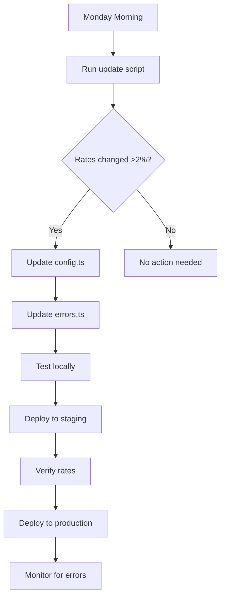

# Currency Rate Update Guide

## When to Update Rates

Update the fallback rates when:
- ✅ Major currency fluctuations (>5% change)
- ✅ Monthly or quarterly maintenance
- ✅ API provider changes rates
- ✅ After major economic events

## How to Update Rates

### Step 1: Get Current Rates

Visit these sources for accurate rates:
- **XE.com**: https://www.xe.com/currencyconverter/
- **Google Finance**: Search "CAD to NGN"
- **Your Bank**: Commercial rates
- **Fixer.io Dashboard**: Your API data

### Step 2: Update Both Files

#### File 1: `src/lib/currency/config.ts`

Find the `FALLBACK_RATES` object (around line 185):

```typescript
export const FALLBACK_RATES: Record<string, Record<string, number>> = {
  CAD: {
    NGN: 1050,  // ← UPDATE THIS (e.g., change to 1055)
    USD: 0.699,
    // ... other rates
  },
  USD: {
    CAD: 1.43,  // ← UPDATE THIS TOO (inverse relationship)
    // ... other rates
  }
}
```

#### File 2: `src/lib/currency/errors.ts`

Find the `FallbackRateProvider.STATIC_RATES` object (around line 302):

```typescript
private static readonly STATIC_RATES: Record<string, Record<string, number>> = {
  CAD: {
    NGN: 1050,  // ← UPDATE THIS (keep in sync with config.ts)
    USD: 0.699,
    // ... other rates
  }
}
```

### Step 3: Clear Cache

After updating, users need fresh rates:

**Option A - User clears manually**:
```javascript
// In browser console
currencyUtils.clearCache()
```

**Option B - Force clear on app update** (Recommended):
```typescript
// In main.tsx or App.tsx
import { clearAllCurrencyCaches } from './lib/currency/clearCache';

// Check app version changed
const CURRENT_VERSION = '1.2.0';
const storedVersion = localStorage.getItem('app_version');

if (storedVersion !== CURRENT_VERSION) {
  clearAllCurrencyCaches();
  localStorage.setItem('app_version', CURRENT_VERSION);
  console.log('✅ Currency cache cleared due to app update');
}
```

### Step 4: Verify Update

```javascript
// In browser console
await currencyUtils.validateCAD()

// Expected output with new rate:
// ✅ Current rate: 1 CAD = 1055.00 NGN
// ✅ Test conversion: C$35,000 = ₦36,925,000
```

---

## 🔄 Automated Update Options

### Option 1: Weekly Script (Simple)

Create `scripts/updateCurrencyRates.js`:

```javascript
import fetch from 'node-fetch';
import fs from 'fs';

const FIXER_API_KEY = process.env.VITE_FIXER_API_KEY;

async function updateRates() {
  console.log('📊 Fetching current rates from Fixer.io...');

  const response = await fetch(
    `https://api.fixer.io/v1/latest?access_key=${FIXER_API_KEY}&base=USD&symbols=CAD,NGN,GBP,EUR`
  );

  const data = await response.json();

  if (!data.success) {
    console.error('❌ API Error:', data.error);
    return;
  }

  console.log('✅ Current rates:', data.rates);
  console.log('\n📝 Update these in config.ts and errors.ts:');
  console.log(`USD.CAD = ${data.rates.CAD}`);
  console.log(`USD.NGN = ${data.rates.NGN}`);

  // Calculate CAD to NGN
  const cadToNgn = data.rates.NGN / data.rates.CAD;
  console.log(`CAD.NGN = ${cadToNgn.toFixed(0)}`);
}

updateRates();
```

**Run weekly**:
```bash
node scripts/updateCurrencyRates.js
```

### Option 2: GitHub Action (Automated)

Create `.github/workflows/update-currency-rates.yml`:

```yaml
name: Update Currency Rates

on:
  schedule:
    - cron: '0 0 * * 1'  # Every Monday at midnight
  workflow_dispatch:  # Manual trigger

jobs:
  update-rates:
    runs-on: ubuntu-latest
    steps:
      - uses: actions/checkout@v3

      - name: Fetch Current Rates
        run: |
          curl "https://api.fixer.io/v1/latest?access_key=${{ secrets.FIXER_API_KEY }}&base=USD&symbols=CAD,NGN,GBP,EUR"

      - name: Create Issue if Rates Changed
        uses: actions/github-script@v6
        with:
          script: |
            github.rest.issues.create({
              owner: context.repo.owner,
              repo: context.repo.repo,
              title: '📊 Currency Rates Need Update',
              body: 'Weekly check: Review and update fallback rates in config.ts'
            })
```

### Option 3: Admin Dashboard (Advanced)

Create an admin page where you can update rates directly:

```typescript
// components/admin/CurrencyRateManager.tsx
export const CurrencyRateManager = () => {
  const [rates, setRates] = useState({
    cadToNgn: 1050,
    usdToCad: 1.43,
    // ... more
  });

  const fetchLatestRates = async () => {
    // Fetch from Fixer API
    const response = await fetch('/api/currency/latest');
    const data = await response.json();
    setRates(data);
  };

  const updateFallbackRates = async () => {
    // Update config.ts programmatically
    await fetch('/api/currency/update-fallback', {
      method: 'POST',
      body: JSON.stringify(rates)
    });

    // Clear all user caches
    await fetch('/api/currency/clear-cache-all');
  };

  return (
    <div className="p-6">
      <h2>Currency Rate Manager</h2>
      <button onClick={fetchLatestRates}>
        Fetch Latest Rates
      </button>
      <button onClick={updateFallbackRates}>
        Update Fallback Rates
      </button>
      {/* Display current vs new rates */}
    </div>
  );
};
```

---

## 📊 Rate Monitoring

### Add Rate Staleness Warnings

```typescript
// In your currency display component
const { rate, source, timestamp } = await currencyService.getExchangeRate('CAD', 'NGN');

const rateAge = Date.now() - timestamp.getTime();
const isStale = rateAge > 7 * 24 * 60 * 60 * 1000; // 7 days

{isStale && source === 'fallback' && (
  <div className="text-xs text-yellow-600 flex items-center gap-1">
    <AlertCircle className="h-3 w-3" />
    Rate from {new Date(timestamp).toLocaleDateString()}
  </div>
)}
```

### Add Rate Source Indicator

```typescript
const sourceLabels = {
  api: '🌐 Live Rate',
  cache: '📦 Cached',
  fallback: '⚠️ Fallback'
};

<span className="text-xs text-gray-500">
  {sourceLabels[source]}
</span>
```

---

## 🎯 Recommended Update Schedule

### For Production Apps

| Frequency | Action | Method |
|-----------|--------|--------|
| **Real-time** | API fetches | Automatic (if API key valid) |
| **Hourly** | Cache expires | Automatic |
| **Weekly** | Check rates | Manual or script |
| **Monthly** | Update fallback | Manual update files |
| **Quarterly** | Full audit | Review all pairs |

### Update Process



---

## 🚨 Emergency Rate Update

If there's a major economic event (currency crash, etc.):

### 1. Quick Fix (5 minutes)

```bash
# 1. Get latest rate
curl "https://api.fixer.io/v1/latest?access_key=YOUR_KEY&base=CAD&symbols=NGN"

# 2. Update config.ts line 206:
CAD: {
  NGN: NEW_RATE_HERE,  // Change immediately
}

# 3. Update errors.ts line 315:
CAD: {
  NGN: NEW_RATE_HERE,  // Keep in sync
}

# 4. Commit and deploy
git add src/lib/currency/config.ts src/lib/currency/errors.ts
git commit -m "Emergency: Update CAD-NGN rate to X"
git push
```

### 2. Force Cache Clear for All Users

```typescript
// Add to your app initialization
const RATE_UPDATE_DATE = new Date('2025-10-12');
const lastClearDate = new Date(localStorage.getItem('last_currency_clear') || 0);

if (lastClearDate < RATE_UPDATE_DATE) {
  clearAllCurrencyCaches();
  localStorage.setItem('last_currency_clear', RATE_UPDATE_DATE.toISOString());

  // Show notification to user
  showNotification('Currency rates have been updated to reflect current values');
}
```

---

## 📝 Update Checklist Template

Use this when updating rates:

```markdown
## Currency Rate Update - [Date]

### Rates Changed
- [ ] CAD → NGN: 1050 → 1055 (+0.5%)
- [ ] USD → CAD: 1.43 → 1.45 (+1.4%)
- [ ] Updated in config.ts
- [ ] Updated in errors.ts
- [ ] Rates are in sync

### Testing
- [ ] Ran `currencyUtils.validateCAD()`
- [ ] Tested on programs page
- [ ] Verified C$35,000 shows correct NGN amount
- [ ] Tested other currency pairs

### Deployment
- [ ] Committed changes
- [ ] Deployed to staging
- [ ] Verified on staging
- [ ] Deployed to production
- [ ] Monitored for errors

### Communication
- [ ] Updated changelog
- [ ] Notified team
- [ ] User notification (if needed)
```

---

## 💡 Best Practices

1. **Always update both files** (`config.ts` and `errors.ts`)
2. **Keep inverse rates in sync** (USD→CAD and CAD→USD)
3. **Test before deploying** (`currencyUtils.validateCAD()`)
4. **Document changes** (git commit message)
5. **Monitor after deployment** (check logs for errors)

---

## 🔗 Useful Rate Sources

- **XE.com**: https://www.xe.com/currencyconverter/
- **Fixer.io**: https://fixer.io/dashboard
- **Central Bank of Nigeria**: https://www.cbn.gov.ng/rates/
- **Bank of Canada**: https://www.bankofcanada.ca/rates/
- **Google Finance**: https://www.google.com/finance

---

**Remember**: The fallback rates are safety nets. As long as your Fixer API key is working, users will see real-time accurate rates automatically! The fallback rates only matter when the API fails.
